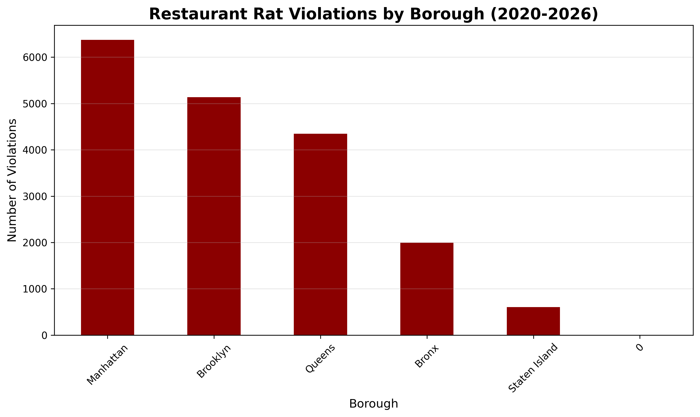
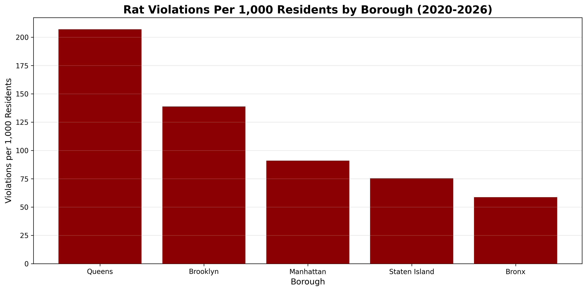
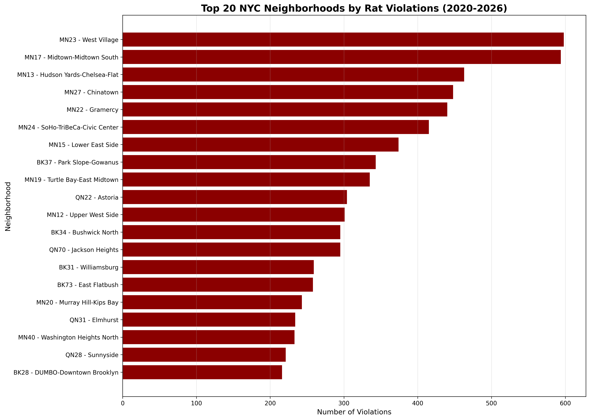

# 🐀 Any Rats?

**NYC Neighborhood Pest Risk Analysis Using Public Data**

Analysis of 18,455+ restaurant violations (2020-2026) to identify which NYC neighborhoods have the worst rodent problems.

🔗 **Live Site:** [theoryofvalues.com](https://theoryofvalues.com)

---

## 📊 Key Findings

### 1. **Queens has the worst rat problem per capita**
- **Queens:** 207 violations per 1,000 residents
- **Brooklyn:** 139 per 1,000
- **Manhattan:** 91 per 1,000
- **Bronx:** 59 per 1,000 (cleanest!)

### 2. **Manhattan dominates worst neighborhoods**
Top 5 neighborhoods by violations:
1. West Village (MN23): 600+
2. Midtown South (MN17): 590+
3. Hudson Yards-Chelsea-Flatiron (MN13): 490+
4. Chinatown (MN27): 430+
5. Gramercy (MN22): 410+

### 3. **The problem is getting worse**
97% of all violations since 2008 occurred in 2020-2026.

---

## 📁 Data Sources

All data from [NYC Open Data](https://opendata.cityofnewyork.us/):

- [**Restaurant Inspections**](https://data.cityofnewyork.us/Health/DOHMH-New-York-City-Restaurant-Inspection-Results/43nn-pn8j) — 18,704 violations for rodent/mice presence (codes 04K, 04L)
- [**311 Rat Sightings**](https://data.cityofnewyork.us/Social-Services/Rat-Sightings/3q43-55fe) — Citizen complaints from 2010-present
- [**Official Rodent Inspections**](https://data.cityofnewyork.us/Health/Rodent-Inspection/p937-wjvj) — DOHMH inspection results

---

## 🛠️ Methodology

1. **Data Collection:** Pulled 5 years of restaurant violations (2020-2026) via Socrata API
2. **Filtering:** Isolated rodent-specific violations (codes 04K, 04L)
3. **Normalization:** Adjusted for population density by borough
4. **Geographic Analysis:** Mapped violations to NYC's 190 Neighborhood Tabulation Areas (NTAs)
5. **Visualization:** Created comparative charts to identify patterns

**Tools Used:**
- Python (pandas, matplotlib, sodapy)
- Google Colab
- NYC Open Data API

---

## 📈 Visualizations

### Borough-Level Analysis


### Per Capita Comparison


### Top 20 Neighborhoods


---

## 💻 Running the Analysis

### Prerequisites
```bash
pip install pandas matplotlib sodapy
```

### Run Notebook
Open `any_rats_analysis.ipynb` in Google Colab or Jupyter Notebook and run all cells.

The notebook will:
1. Load data from NYC Open Data
2. Process and filter violations
3. Generate all visualizations
4. Save charts as PNG files

---

## 🎯 Use Cases

- **Renters:** Check neighborhood before signing a lease
- **Buyers:** Assess property locations
- **Tourists:** Choose hotels in cleaner areas
- **Businesses:** Site selection for offices/restaurants
- **Researchers:** Study urban pest patterns

---

## 📝 License

MIT License - Feel free to use this analysis for your own projects.

---

## 👤 Author

**Yulia Winslow**

Data analyst finding unconventional insights in public datasets.

- 🌐 Website: [theoryofvalues.com](https://theoryofvalues.com)
- 📧 Contact: [Contact Form](https://theoryofvalues.com#contact)

---

⭐ **Star this repo if you found it useful!**

🐀 **Know someone in NYC? Share this page: [theoryofvalues.com](https://theoryofvalues.com)**

**Have an idea for unconventional data analysis?** [Reach out!](https://theoryofvalues.com#contact)

---

⭐ **Star this repo if you found it useful!**

🐀 **Share with anyone in NYC**
